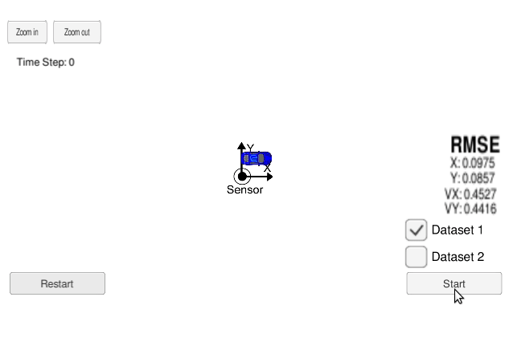

# Extended Kalman Filter Project
Self-Driving Car Engineer Nanodegree Program

In this project a Kalman filter is designed to estimate the state of a moving object of interest with noisy lidar and radar measurements.
In the video we see the estimated state with green triangles and the noisy measurements from the sensors are the circles.

The program is run with a simulator of a moving object from which the noisy measurements are provided.
The measurements are processed by the Kalman filter which contains a motion model of the object and uses the measurements to estimate the object position and velocity in 2D (x and y).

The object model is a model with constant velocity in cartesian space. Acceleration comes in as a process noise and the motion is therefore modelled linearly.
The lidar provides only position measurement in cartesian space, so a linear Kalman filter is used for the update function.
The radar provides position and velocity measurement in polar space, so an extended Kalman filter is used for the update function.

The simulator provides ground truth i.e. actual state of the moving object. RMSE (root mean square error) is calculated between ground truth state and the state estimated by the Kalman filter.

---
